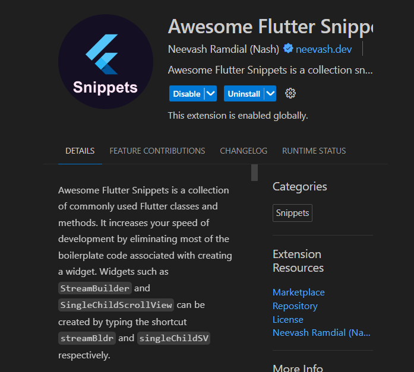
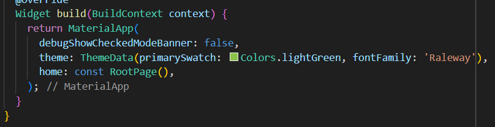

# Entry 2
## 12/17/23

My current stage in the **Engineering Design Process (EDP)** is **planning the solution**. There are many ways programmers can do to reduce high unemployment, such as making websites, apps, or even advertisements that can draw in some people. I want to focus on making an App because apps tend to be more popular in this generation. My next step would be creating prototypes to strengthen my knowledge of Flutter. 

### Content
**1. Using VsCode Extensions** <br>



[Awesome Flutter Snippets](https://marketplace.visualstudio.com/items?itemName=Nash.awesome-flutter-snippets) is a very useful tool that allows me to auto-fill in the code that I am trying to type. For example, when I type a widget it gives suggestions or guesses as to what I am trying to type. This is a time-saving tool for users to use. 

**2. Learning about the keywords** <br>



I learned that in [Flutter](https://docs.flutter.dev/get-started/install) there are keywords that do certain things such as in this case the debugShowCheckedModeBanner is set to false so that the banner on the app would be taken away. For the home, it is the home page or the first page of the app. It is possible to add different fonts in the app, but currently, I am still trying to figure out how it works. I also watched [tutorial](https://www.youtube.com/watch?v=C-fKAzdTrLU&t=163s) for me to process all the information I have learned right now.

**Goal is for winter break** <br>
My target is trying to create the homepage of the app. I want the app to contain a logo and a login page. If the login process page is too complex then I would try to make the main screen where people can post their information. <br>
```
1-2 days- Make a logo.
3-4 days- Watch videos about the login page.
5-6 days- Try to make my very own login page.
6-7 days- Try to make the login page connect to the second layer page.
```

**Skills:** Two skills I developed for this entry.
1. I learned **how to google** by trying to understand what the extension does such as [Awesome Flutter Snippets](https://marketplace.visualstudio.com/items?itemName=Nash.awesome-flutter-snippets).
2. I learned **how to learn** by following tutorials about creating a beginner-friendly App. I was able to understand the process, but the keywords are still a bit challenging for me to understand. Currently, I am still following the tutorial to learn more skills from the experts. I also tried to do my own code by trying to figure out how the font works within [Flutter](https://docs.flutter.dev/get-started/install).

[Previous](entry01.md) | [Next](entry03.md)

[Home](../README.md)