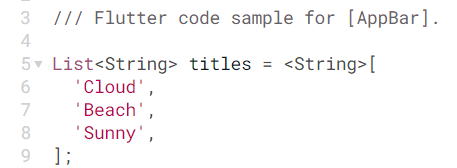
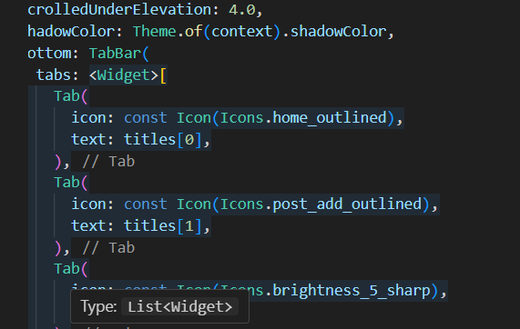
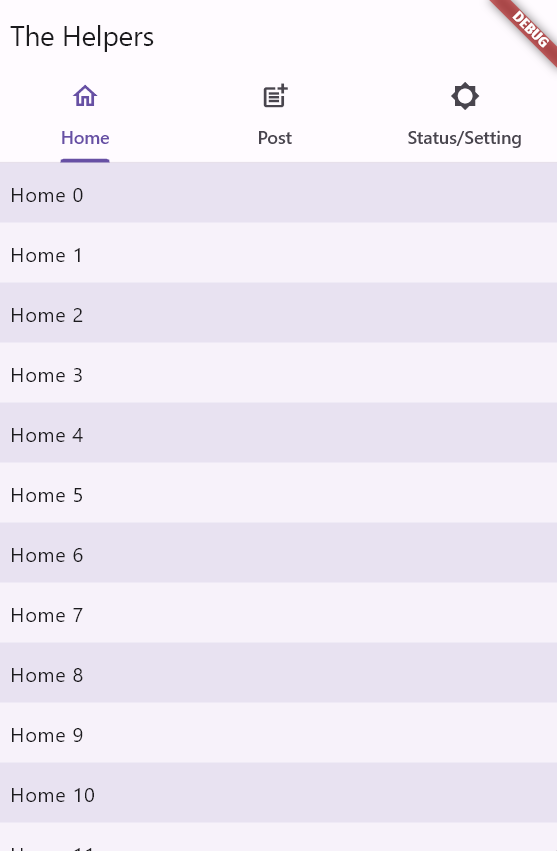

# Entry 3
## 2/10/24

My current stage in the **Engineering Design Process (EDP)** is **creating a prototype**. I would be making a screen where employers can post jobs for those who are looking for jobs. If I have more time I would try to make other pages within the app such as the unemployed people's screen. My next step would be **test** the prototype and see if there are any errors.

### Content
**1. Learning Documentation**  

Using this example [documentation](https://api.flutter.dev/flutter/material/AppBar-class.html), I realized that these are the names for each list section so I changed the names to `Home, Post, Stauts/Setting`.

I also search up [icon](https://api.flutter.dev/flutter/material/Icons-class.html) to change the original one so it can be more fitting to the new names that I have given. 

As a result, this is how it looks like:

**What to learn next**

1. I want to have a better understanding of the text tool so that when certain text is being written it would be posted on the front page of the screen and hopefully it would be interactive later on.
2. How to make a form with the same questions so that each post would be organized and it wouldn't be a mess.

**Skills:** Two skills I developed for this entry.
1. I learned **how to google** by exploring the [documentation](https://api.flutter.dev/flutter/material/AppBar-class.html) to understand the basics of Flutter and using examples that might be useful for my project.
2. I learned **how to learn** by using examples and reworking them to have a better understanding. In this case, I learned that the list of names and the [icons](https://api.flutter.dev/flutter/material/Icons-class.html) can be changed with the help of input code from Flutter.

 

[Previous](entry02.md) | [Next](entry04.md)

[Home](../README.md)