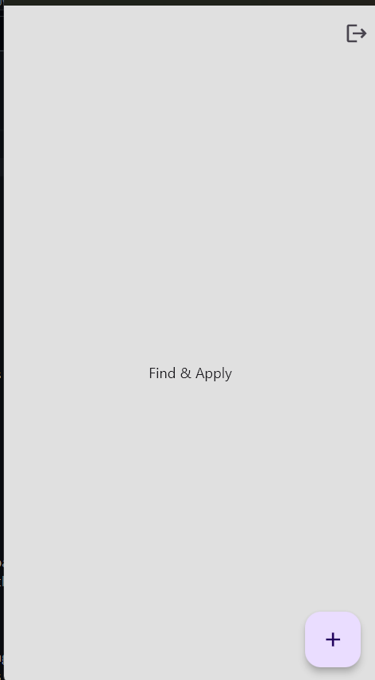

# Entry 5
## 5/5/24

My current stage in the Engineering Design Process (EDP) is creating a prototype because I realized that my tool needs Firebase for it to work the way I want so I am still trying to figure out the functionality of Firebase, but my UI MVP is completed. My flutter has reached the MVP but my firebase still needs some work to do.

### Content

**1. Making a login page**  

- Using flutter build functions to my advantage 
- Using the Flutter built-in function to change the design of the pages.
- got a logo on Google and implemented it in my assets folder to put it on my login page.
- making the login page have the register page.

    - making the UI of a register page. (Enter email, password, confirm password).

**2. Making the main page**

- The login page would lead to the main page.

    - On the top right corner there is a button that redirects the user to the login page

**3. Making posting page**
- On the bottom right, there is an add button.

    - it shows a list of questions when the user presses post it will post onto the main page 
    (not done need Firebase).

---

#### Next Step:

I would be creating the page and making sections to organize the page such as having settings and a homepage button so it brings the users to the respected area they pressed.

#### Skills: Two skills I developed for this entry.
1. I learned how to google to further my understanding of app development. Realizing many built-in tools in [Flutter](https://docs.flutter.dev/ui) can be utilized by developers to their liking.
2. I learned how to learn by realizing that my MVP's design is done but the functionality is not because I needed an external tool to make it work which is [Firebase](https://firebase.google.com/).

[Previous](entry04.md) | [Next](entry06.md)

[Home](../README.md)